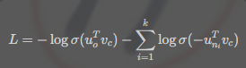
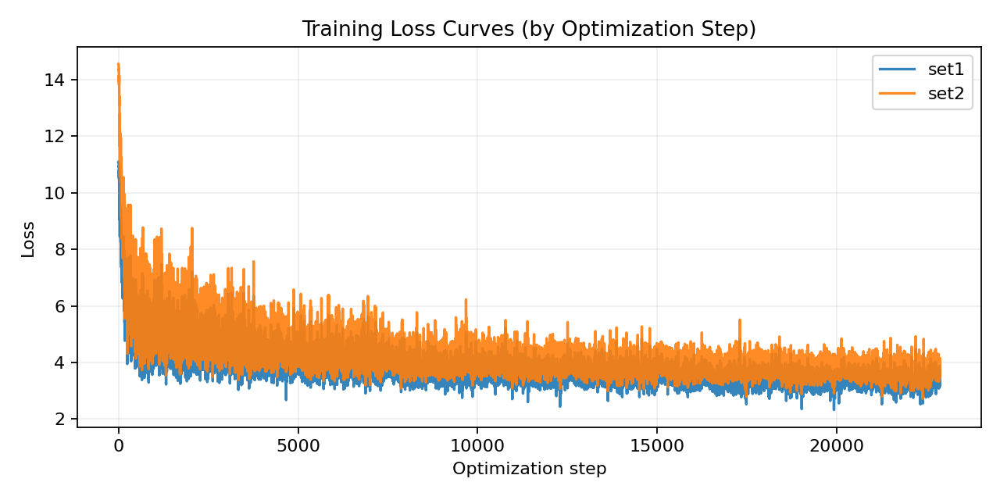
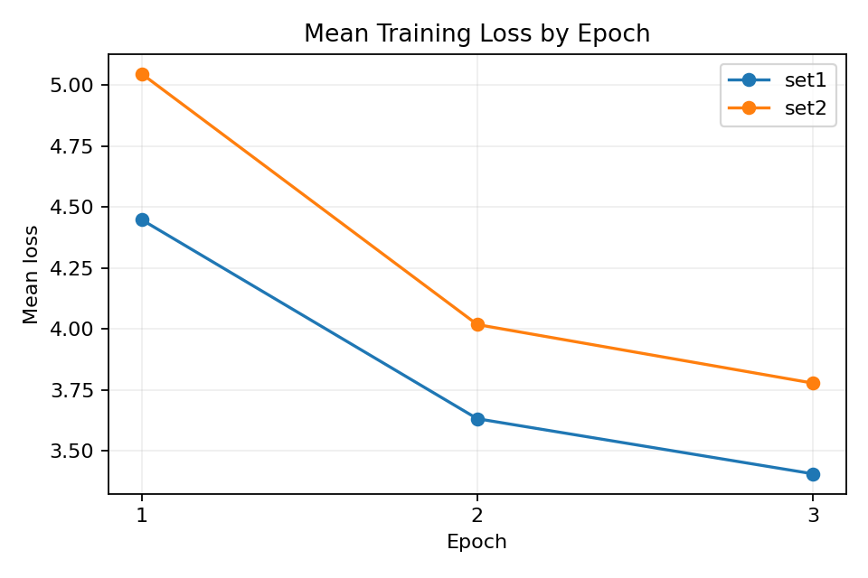
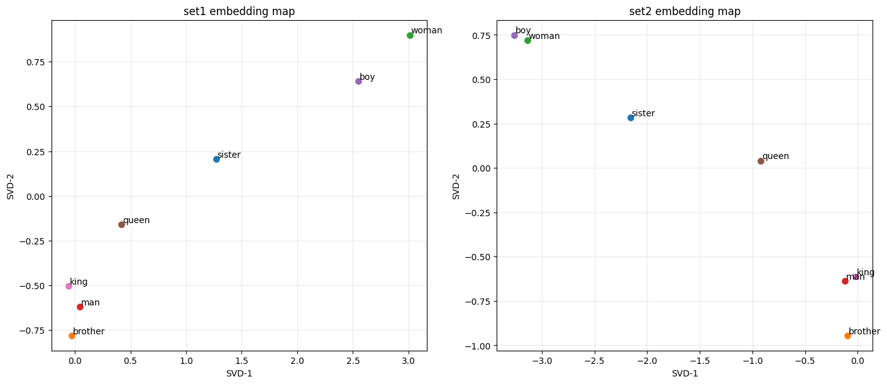

# CS310 Natural Language Processing
# Assignment 2 实验报告：Word2Vec (Skip-gram + Negative Sampling)

## 1. 实验目标
在 Shakespeare 语料上实现并训练 Word2Vec 的 Skip-gram + Negative Sampling 模型，并完成：

1. 数据处理与训练样本构建。
2. SkipGram 模型与损失函数实现。
3. 训练过程记录与损失下降趋势展示。
4. 两组超参数对比与词类比任务评估。
5. 词向量导出与降维可视化。

## 2. 数据与文件

- 训练语料：`shakespeare.txt`
- 评估文件：`questions-words-shakespeare.csv`
- 实现文件：`A2_w2v.ipynb`
- 报告文件：`report.md`

## 3. 方法实现

### 3.1 数据处理

实现了 `generate_data(words, window_size, k, corpus)` 与 `batchify(data, batch_size)`：

1. 对每个中心词提取窗口内上下文词作为正样本。
2. 使用 `corpus.getNegatives(...)` 采样负样本。
3. 组织为 `(center, outside, negatives)` 并批量张量化。

### 3.2 模型与损失

`SkipGram` 使用两套 embedding：`emb_v`（中心词）与 `emb_u`（上下文词）。

损失采用负采样目标：

实现中对分数做 `clamp(-10, 10)` 以增强数值稳定性。

### 3.3 训练流程

`train(model, dataloader, optimizer, epochs)` 完成：

1. batch 级前向、反向与优化。
2. 按间隔打印近期平均 loss。
3. 返回 step 级损失序列用于绘图。

## 4. 实验设置（按评分建议）

本次评测采用 **Top-5** 词类比标准（`topn=5`），并按建议使用更强超参数：

- Set1
  - `emb_size = 150`
  - `k = 15`
  - `window_size = 5`
  - `epochs = 3`
  - `batch_size = 128`
  - `lr = 0.01`
  - `topn_eval = 5`

- Set2
  - `emb_size = 200`
  - `k = 20`
  - `window_size = 5`
  - `epochs = 3`
  - `batch_size = 128`
  - `lr = 0.008`
  - `topn_eval = 5`

两组均满足“same epochs”。

epochs 取 3 的简要理由：在当前设置下，loss 曲线已呈明显下降且第 3 轮后进入缓降区；同时 Top-5 analogy 准确率已达到评分要求（>1%）。因此本次采用 `epochs=3` 作为效果与训练成本的折中选择。

## 5. 结果与分析

### 5.1 词类比准确率（Top-5）

| Set | emb_size | k | window_size | epochs | topn | Accuracy | Hit/Total |
|---|---:|---:|---:|---:|---:|---:|---|
| Set1 | 150 | 15 | 5 | 3 | 5 | 0.020492 | 15/732 |
| Set2 | 200 | 20 | 5 | 3 | 5 | 0.021858 | 16/732 |

结论：两组都达到并超过 1%（Top-5）标准，Set2 略优。

### 5.2 损失曲线（Requirement 3a）

#### 图 1：按 optimization step 的损失曲线

该图显示 loss 在前期快速下降，后期缓慢下降并趋稳，存在小幅抖动但总体单调下降趋势明显。这样只能看到总体趋势，但后面效果不明显，所以我们再以epoch为横坐标来画图。

#### 图 2：按 epoch 的平均损失

观察到每个 epoch 的平均 loss 逐轮下降，进一步验证训练收敛趋势。

### 5.3 关于横轴选择（Requirement 3b 相关说明）

报告同时给出两种横轴是最完整的做法：

1. `Optimization step`：点更密，最能展示训练全过程下降趋势。
2. `Epoch`：更简洁，便于概览每轮平均损失变化。

因此本报告两图并列展示，满足趋势说明与可读性要求。

## 6. 词向量导出与可视化

已按 `gensim` 兼容格式导出：

- `embeddings_set1.txt`
- `embeddings_set2_ember.txt`
- `embeddings.txt`

用 `TruncatedSVD(n_components=2)` 对词向量降维，并对指定词（如 `sister, brother, woman, man, girl, boy, queen, king`）进行二维可视化得到如下图所示。

## 7. 总结

本实验完整实现了 Word2Vec Skip-gram + Negative Sampling 的训练与评估流程。在 Top-5 词类比标准下，两组设置均超过 1% 基准；同时，发现step 级与 epoch 级两类损失图均显示清晰下降趋势，满足要求。
