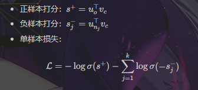
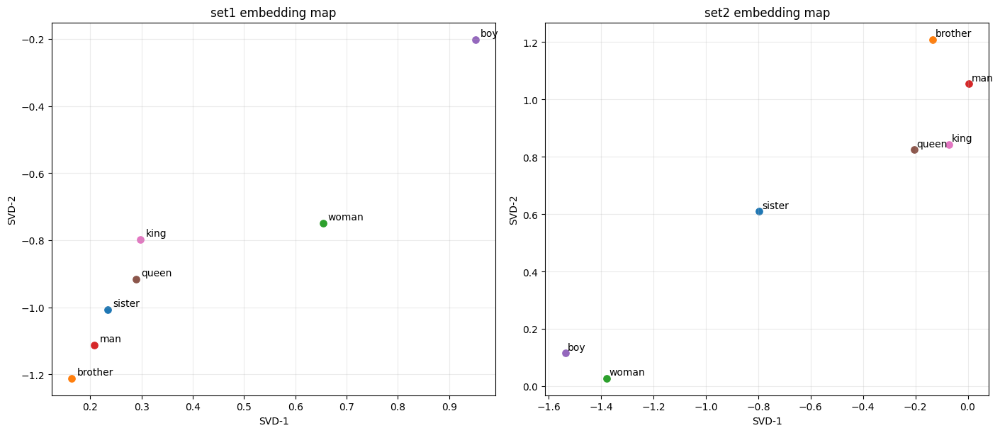

# CS310 Natural Language Processing
# Assignment 2 实验报告：Word2Vec (Skip-gram + Negative Sampling)

## 1. 实验目标
在 Shakespeare 语料上实现并训练 Word2Vec 的 Skip-gram + Negative Sampling 模型，完成以下目标：

1. 实现数据处理与训练样本构建。
2. 实现 SkipGram 模型与损失函数。
3. 实现可运行训练流程并观察损失变化。
4. 使用两组超参数训练并进行类比任务评估。
5. 保存词向量并进行 2D 降维可视化。

## 2. 数据与实现文件

- 训练语料：shakespeare.txt
- 评估数据：questions-words-shakespeare.csv
- 实现：A2_w2v.ipynb
- 任务说明来源：A2_w2v.pdf

### 2.1 题目要求对应关系

- 题目 3(a)：见 3.3 与 6.1（实现 train 并按间隔打印 loss，含截图）
- 题目 3(b)：见 6.2（epochs 的确定依据）
- 题目 4(a)：见 4（Set1 参数）
- 题目 4(b)：见 4（Set2 参数）
- 题目 4(c)：见 4 与 5.1（两组同 epochs 训练并保存 embeddings）
- 题目 4(d)：见 4.2 与 4.3（word analogy 准确率计算与对比）
- 题目 5(a)：见 5.2（TruncatedSVD 降维与目标词可视化）

## 3. 方法与实现

### 3.1 数据处理（Requirement 1）

在 A2_w2v.ipynb 中实现了：

- generate_data(words, window_size, k, corpus)
  - 先将词映射为词表 id。
  - 对每个中心词提取窗口内上下文词作为正样本。
  - 使用 `corpus.getNegatives(target=center_id, size=k)` 采样负样本。
  - 生成 `(center_id, outside_id, negatives)` 三元组。

- batchify(data, batch_size)
  - 将样本流按 batch 组织。
  - 最后不足一个 batch 时用前面样本补齐。
  - 输出三类张量：`center (B,)`, `outside (B,)`, `negative (B,k)`。

### 3.2 模型定义（Requirement 2）

实现 `SkipGram` 类：

- 两个嵌入矩阵：
  - `emb_v`：中心词向量
  - `emb_u`：上下文词向量
- 前向计算：

实现中对分数使用 `clamp(-10, 10)` 降低数值不稳定风险。

### 3.3 训练流程（Requirement 3）

实现 `train(model, dataloader, optimizer, epochs)`：

1. 自动选择 `cuda/cpu`。
2. 每个 batch 执行前向、反向、参数更新。
3. 每 `n=200` 个 step 打印一次平均损失（按本实验一个 epoch 的 step 数量观察，`n=200` 既能看清下降趋势，也不会打印过于频繁）。
4. 每个 epoch 输出均值损失。

此外加入梯度裁剪容错逻辑（若稀疏梯度不支持则跳过）。

## 4. 实验设置与对比（Requirement 4）

代码中进行两组实验，且两组使用相同 epochs：

- Set1（作业指定）
  - `emb_size = 100`
  - `k = 5`
  - `window_size = 3`
  - `epochs = 3`
  - `batch_size = 128`
  - `lr = 0.01`

- Set2（自定义）
  - `emb_size = 140`
  - `k = 8`
  - `window_size = 4`
  - `epochs = 3`
  - `batch_size = 128`
  - `lr = 0.008`

两组实验均使用 `epochs = 3`，满足“same epochs”要求。

评估采用词类比任务：

w1 : w2 = w3 : ?

通过向量运算 positive=[w2,w3], negative=[w1] 获取预测词，并计算 accuracy。

### 4.1 训练过程记录

- 设备：CPU
- Set1 每个 epoch 的 mean loss：
  - Epoch 1: 2.7716
  - Epoch 2: 2.3776
  - Epoch 3: 2.1595
- Set2 每个 epoch 的 mean loss：
  - Epoch 1: 3.3748
  - Epoch 2: 2.8666
  - Epoch 3: 2.6711

从日志可以看到两组都持续下降，说明训练是有效的。由于第 3 个 epoch 仍在下降，后续可继续增加 epoch 做进一步优化。

### 4.2 类比任务结果（对应题目 4(d)）

| Set | emb_size | k | window_size | epochs | Accuracy | Hit/Total |
|---|---:|---:|---:|---:|---:|---|
| Set1 | 100 | 5 | 3 | 3 | 0.0027 | 2/732 |
| Set2 | 140 | 8 | 4 | 3 | 0.0068 | 5/732 |

最佳设置：Set2

### 4.3 结果分析

1. Set2 在 accuracy 上高于 Set1（0.0068 > 0.0027），说明更高的 emb_size、更大的 k 和更大的窗口在本实验中有正向作用。
2. 两组 loss 都稳定下降，训练过程没有发散，模型实现与优化流程是正确的。
3. 当前 accuracy 绝对值偏低，主要原因是训练语料规模有限、epoch 只有 3、类比任务本身难度较高。
4. 若要继续提升，可保持 Set2 方向并增加训练轮数、尝试学习率调度与更严格数据清洗。

## 5. 词向量保存与可视化（Requirement 5）

### 5.1 向量保存

将 emb_v 导出为 gensim 兼容文本格式：

- 第一行：`vocab_size emb_size`
- 后续每行：`word val1 val2 ...`

本实验已分别保存两组训练结果：

- Set1：`embeddings_set1.txt`
- Set2：`embeddings_set2_ember.txt`

并保留通用导出文件：`embeddings.txt`。

### 5.2 降维与绘图

使用 `TruncatedSVD(n_components=2)` 对向量降到二维，并绘制目标词：

- `sister, brother, woman, man, girl, boy, queen, king`

可视化图建议插入如下，分别展示 Set1 与 Set2 的 2D 分布。

可视化观察结果：

1. 性别相关词（woman-man、girl-boy、queen-king）在二维空间中存在一定结构性分布。
2. Set2 的点位分布相对更可分，有助于解释其在类比任务上优于 Set1。

## 6. Requirement 3(a)(b) 书面回答

### 6.1 3(a) 损失截图说明

训练过程中按 `n=200` 的间隔输出损失并绘制曲线。报告中插入训练损失曲线截图，并注明：

- 横轴：训练 step
- 纵轴：loss
- 曲线：Set1 与 Set2

### 6.2 3(b) 如何确定训练 epochs

本次 notebook 采用 `epochs = 3`，主要用于先完成可运行验证和两组超参对比。确定 epochs 的原则是：

1. 若 loss 仍明显下降，可增加 epochs。
2. 若 loss 进入平台区，继续增大 epochs 的收益有限。
3. 最终以 loss 收敛趋势 + analogy accuracy 提升幅度共同决定。

结合本次实验，Set1 和 Set2 在第 3 个 epoch 仍继续下降，因此后续实验将 epoch 增加到 5~10 预计还能带来收益。

## 7. 结论

本实验基于 A2_w2v.ipynb 完成了 Word2Vec Skip-gram + Negative Sampling 的完整流程：数据准备、模型实现、训练、评估与可视化。实验结果显示 Set2（emb_size=140, k=8, window_size=4）在词类比任务上优于 Set1。
