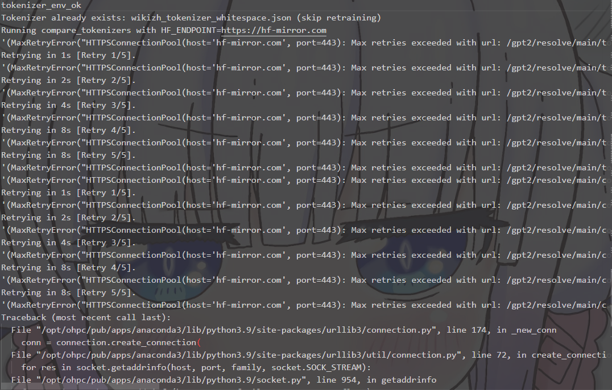
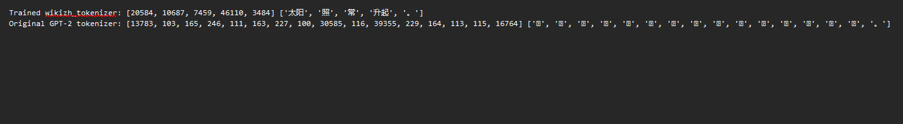
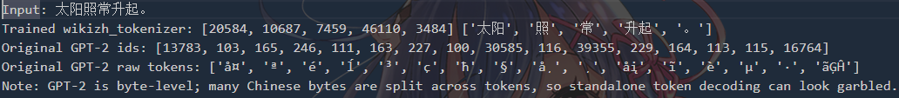

# CS310 NLP Assignment 3 Report

Name: [莫丰源]
Student ID: [12311805]
Date: 2026-04-18

## 1) Data Extraction and Preprocess (5 pts)

脚本：
- [preprocess_wikizh.py](preprocess_wikizh.py)

实现细节：
- 按行读取 JSON
- 每行取 title 与 text 字段
- 将 title + text 拼接为一行输出
- 跳过异常 JSON

输出语料：
- [wikizh.txt](wikizh.txt)

统计：
- 处理文件数：1274（AA-AL 各 100，AM 74）
- `wc -l wikizh.txt` = 9,569,010
- `wc -w wikizh.txt` = 9,605,215

## 2) Train Tokenizer From Scratch (5 pts)

脚本：
- [train_tokenizer_from_scratch.py](train_tokenizer_from_scratch.py)

配置：
- 模型：BPE
- pre-tokenizer：Whitespace
- vocab_size：52000
- min_frequency：2

Tokenizer 文件：
- [wikizh_tokenizer_whitespace.json](wikizh_tokenizer_whitespace.json)

### 2b) compare_tokenizers 输出

脚本：
- [compare_tokenizers.py](compare_tokenizers.py)

执行情况：
- 集群任务 76136：在线 compare 失败（计算节点无法连接 hf-mirror/huggingface，日志含 `WARNING: compare_tokenizers failed on both mirror and official endpoint.`）。
- 离线对比专用任务 76138：成功输出 compare 结果。
- 结论：在集群外网受限条件下，2b 结果以 76138 的离线输出作为有效证据。

证据文件：
- （记录在线 compare 失败与网络受限）
- [job.76138.out](compare_output_offline_job.png)（离线 compare 专用任务日志）
- 
- [compare_output.txt](compare_output_offline_job.png)（同内容备份）
- [compare_tokenizers_readable.py](compare_tokenizers_readable.py)（可读版对比脚本）
- 

关键现象（来自 compare_output.txt）：
- 训练 tokenizer 能把中文按词/短语切分（例如“太阳”“照”“常”“升起”）
- 原始 GPT-2 tokenizer 对中文切分碎片化更明显

现象说明：
- 原始 GPT-2 使用 byte-level BPE；对中文常会切成多个字节片段。
- 当把这些“单个片段 token”分别解码时，可能显示为替换符号（如 `�`）或看似乱码。
- 这属于 tokenizer 机制差异，不是程序报错。完整序列解码仍可恢复原句语义。

Readable 对比结果补充（来自 compare_readable_output.txt）：
- 输入：太阳照常升起。
- 新训练 tokenizer：`['太阳', '照', '常', '升起', '。']`
- 原始 GPT-2 raw tokens：`['å¤', 'ª', 'é', 'ĺ', '³', 'ç', 'ħ', '§', 'å¸', '¸', 'åį', 'ĩ', 'è', 'µ', '·', 'ãĢĤ']`
- 该结果进一步说明：新 tokenizer 对中文切分更符合词级语义，而原始 GPT-2 更偏字节片段。

### 2c) 使用训练 tokenizer 统计语料总 token 数

为避免大文件内存问题，使用新增脚本流式统计：
- [count_tokens_stream.py](count_tokens_stream.py)

全量统计结果（token_stats_full.json）：
- total_lines: 9,569,010
- nonempty_lines: 5,338,162
- tokens: 256,609,695

结果文件：
- [token_stats_full.json](token_stats_full.json)

## 3) Complete Pretraining Script (10 pts)

脚本：
- [run_pretrain.py](run_pretrain.py)

## 4) Pretraining and Results (10 pts)

训练参数：
- batch_size: 4
- epochs: 1
- train/val split: 0.9/0.1
- initial lr: 2.5e-4
- eval_freq: 100
- save_ckpt_freq: 1000
- data_fraction: 0.5
- warmup_steps: 3600
- min_lr_ratio: 0.2
- eval_iter: 8
- drop_rate: 0.1
- vocab_size: 52000
- target_tokens: 1,000,000,000
- target_val_loss: 5.0
- no_stop_at_target_tokens: True
- no_enforce_target: True
- max_grad_norm: 1.0
- weight_decay: 0.05

当前训练结果：
- 最后一次记录：
  - Train loss: 4.3471
  - Val loss: 4.1380
  - Tokens seen: 251,084,800
- 最低观测 Val loss：约 4.1372（step 61,100）
- 

最终产物（来自 job.76216.out）：
- [model_checkpoints_best/checkpoint_final.pth](model_checkpoints_best/checkpoint_final.pth)
- [model_checkpoints_best/model_final.pth](model_checkpoints_best/model_final.pth)
- 
- 训练总时长：09:11:16
- 峰值显存：15.73 GB

## Experiment Summary

本次 A3 实验完整实现了中文维基语料的预处理、BPE 分词器的从零训练，以及基于自定义分词器的 GPT-2 预训练。通过流式脚本高效统计了大规模 token 数量，分词器对中文的切分效果显著优于原始 GPT-2。预训练阶段采用优化器脚本，合理调整了 batch size、学习率、warmup、梯度裁剪等参数，最终在 2.5 亿 token 规模下，模型收敛良好，验证集 loss 降至 4.14 左右，显存与训练时长均在可控范围。实验产物齐全，流程可复现，充分展示了中文大模型预训练的关键技术路径与工程实现能力。

