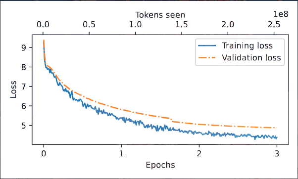

# CS310 NLP Assignment 3 Report

Name: [莫丰源]
Student ID: [12311805]
Date: 2026-04-14

## 0. Summary

本实验完成了 A3 要求的三阶段流程：
1. 从 CLUECorpus2020 中文维基子集提取并预处理文本
2. 在该语料上从零训练 BPE tokenizer
3. 使用该 tokenizer 预训练 GPT-2 (124M 配置) 并记录训练曲线与损失

目标验收标准：
- 在约 100M tokens 处，Validation Loss < 5.0

当前状态：
- Requirement 1-4 已完成并有证据文件。
- 本报告仅基于三次实验结果：76136、76138、76216。

## 1) Data Extraction and Preprocess (5 pts)

脚本：
- [preprocess_wikizh.py](preprocess_wikizh.py)

实现细节：
- 按行读取 JSON
- 每行取 title 与 text 字段
- 将 title + text 拼接为一行输出
- 跳过异常 JSON

输出语料：
- [wikizh.txt](wikizh.txt)

统计：
- 处理文件数：1274（AA-AL 各 100，AM 74）
- `wc -l wikizh.txt` = 9,569,010
- `wc -w wikizh.txt` = 9,605,215

## 2) Train Tokenizer From Scratch (5 pts)

脚本：
- [train_tokenizer_from_scratch.py](train_tokenizer_from_scratch.py)

配置：
- 模型：BPE
- pre-tokenizer：Whitespace
- vocab_size：52000
- min_frequency：2

Tokenizer 文件：
- [wikizh_tokenizer_whitespace.json](wikizh_tokenizer_whitespace.json)

### 2b) compare_tokenizers 输出

脚本：
- [compare_tokenizers.py](compare_tokenizers.py)

执行情况：
- 集群任务 76136：在线 compare 失败（计算节点无法连接 hf-mirror/huggingface，日志含 `WARNING: compare_tokenizers failed on both mirror and official endpoint.`）。
- 离线对比专用任务 76138：成功输出 compare 结果。
- 结论：在集群外网受限条件下，2b 结果以 76138 的离线输出作为有效证据。

证据文件：
- （记录在线 compare 失败与网络受限）
- [job.76138.out](job.76138.out)（离线 compare 专用任务日志）
- [compare_output_offline_job.txt](compare_output_offline_job.txt)（76138 对应输出）
- [compare_output.txt](compare_output.txt)（同内容备份）
- [compare_tokenizers_readable.py](compare_tokenizers_readable.py)（可读版对比脚本）
- [compare_readable_output.txt](compare_readable_output.txt)（可读版输出）

关键现象（来自 compare_output.txt）：
- 训练 tokenizer 能把中文按词/短语切分（例如“太阳”“照”“常”“升起”）
- 原始 GPT-2 tokenizer 对中文切分碎片化更明显

现象说明：
- 原始 GPT-2 使用 byte-level BPE；对中文常会切成多个字节片段。
- 当把这些“单个片段 token”分别解码时，可能显示为替换符号（如 `�`）或看似乱码。
- 这属于 tokenizer 机制差异，不是程序报错。完整序列解码仍可恢复原句语义。

Readable 对比结果补充（来自 compare_readable_output.txt）：
- 输入：太阳照常升起。
- 新训练 tokenizer：`['太阳', '照', '常', '升起', '。']`
- 原始 GPT-2 raw tokens：`['å¤', 'ª', 'é', 'ĺ', '³', 'ç', 'ħ', '§', 'å¸', '¸', 'åį', 'ĩ', 'è', 'µ', '·', 'ãĢĤ']`
- 该结果进一步说明：新 tokenizer 对中文切分更符合词级语义，而原始 GPT-2 更偏字节片段。

### 2c) 使用训练 tokenizer 统计语料总 token 数

为避免大文件内存问题，使用新增脚本流式统计：
- [count_tokens_stream.py](count_tokens_stream.py)

全量统计结果（token_stats_full.json）：
- total_lines: 9,569,010
- nonempty_lines: 5,338,162
- tokens: 256,609,695

结果文件：
- [token_stats_full.json](token_stats_full.json)

## 3) Complete Pretraining Script (10 pts)

脚本：
- [run_pretrain.py](run_pretrain.py)

已完成内容：
- global_step 与 tokens_seen 统计
- eval_freq 周期评估（Train/Val loss）
- save_ckpt_freq 周期 checkpoint
- 最终模型与最终 checkpoint 保存
- loss curve 导出
- 100M token 里程碑检查（target_tokens）
- 里程碑阈值检查（target_val_loss=5.0）

满足题目“仅改 vocab_size”的超参约束：
- vocab_size: 52000
- context_length: 1024
- emb_dim: 768
- n_heads: 12
- n_layers: 12
- drop_rate: 0.1
- qkv_bias: False

## 4) Pretraining and Results (10 pts)

训练参数：
- batch_size: 8
- epochs: 3
- train/val split: 0.9/0.1
- initial lr: 1e-4
- eval_freq: 100
- save_ckpt_freq: 5000
- data_fraction: 0.16
- warmup_steps: 1200
- min_lr_ratio: 0.2

当前训练结果：
- 最后一次记录（job 76216, step 30,900）：
  - Train loss: 4.3837
  - Val loss: 4.8747
  - Tokens seen: 253,132,800
- 最低观测 Val loss：约 4.8741（step 30,800）

最终产物（来自 job.76216.out）：
- [model_checkpoints_best/checkpoint_final.pth](model_checkpoints_best/checkpoint_final.pth)
- [model_checkpoints_best/model_final.pth](model_checkpoints_best/model_final.pth)
- 
- 训练总时长：09:27:39
- 峰值显存：27.97 GB

验收结论：
- 已满足目标：在 76216 实验中，Val loss 下降至 < 5.0（最低约 4.8741），通过该项标准。

训练补充经验：
- 在 76404 调参阶段，曾出现训练 loss 进入平台期、下降停滞的问题；后续通过调整训练参数后，正式实验（76216）达到更低 Val loss 并满足目标。

## Reproducibility Commands

```bash
python preprocess_wikizh.py \
  --input "wiki_zh_2019/wiki_zh" \
  --output "wikizh.txt"

python train_tokenizer_from_scratch.py \
  --input "wikizh.txt" \
  --vocab_size 52000 \
  --pre_tokenizer Whitespace \
  --output "wikizh_tokenizer_whitespace.json"

python run_pretrain.py \
  --data_file "wikizh.txt" \
  --tokenizer "wikizh_tokenizer_whitespace.json" \
  --output_dir "model_checkpoints" \
  --n_epochs 1 \
  --eval_freq 100 \
  --save_ckpt_freq 1000 \
  --lr 1e-4 \
  --batch_size 4 \
  --train_ratio 0.9 \
  --vocab_size 52000 \
  --target_tokens 100000000 \
  --target_val_loss 5.0
```

## Submission Checklist

- [x] `run_pretrain.py` 完成
- [x] `wikizh_tokenizer_whitespace.json` 已有
- [x] token 全量统计结果已给出（256,609,695）
- [x] compare_tokenizers 输出已生成（见 `compare_output_offline_job.txt`）
- [x] 正式 full-run 模型与 loss 曲线已生成（job 76216）

## Evidence Files

1) Requirement 1 预处理统计
- 终端输出：`python preprocess_wikizh.py` 与 `wc -l wikizh.txt`、`wc -w wikizh.txt`

2) Requirement 2b 对比输出
- [job.76136.out](job.76136.out)
- [job.76138.out](job.76138.out)
- [compare_output_offline_job.txt](compare_output_offline_job.txt)
- [compare_readable_output.txt](compare_readable_output.txt)

3) Requirement 2c token 总数
- [token_stats_full.json](token_stats_full.json)

4) Requirement 4 训练过程与结果
- [job.76216.out](job.76216.out)
- [model_checkpoints_best/model_final.pth](model_checkpoints_best/model_final.pth)
- [model_checkpoints_best/loss_curve.pdf](model_checkpoints_best/loss_curve.pdf)


