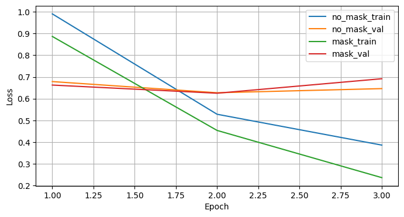
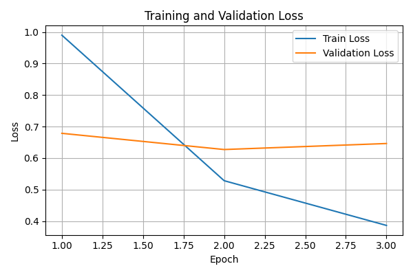
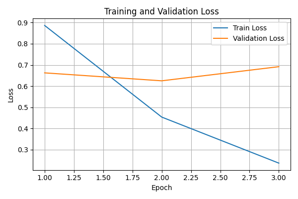
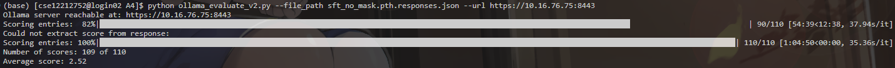
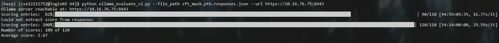

# CS310 Natural Language Processing

## Assignment 4 Report: SFT for GPT-2 (355M)

## 1. 实验目标

本实验使用 instruction-data.json 对 GPT-2 355M 预训练模型进行监督微调（SFT）。任务目标是让模型学会按照指令生成回答，并比较是否对 instruction/input 部分进行 loss masking 对训练与输出质量的影响。

本次作业对应的核心要求包括：

1. 完成 SFT 训练脚本。
2. 实现 instruction/input masking 训练策略。
3. 生成测试集响应，并使用 LLM-as-a-judge 进行自动评测。

## 2. 训练实现

在 run_sft.py 中，我完成了以下关键部分：

1. 模型初始化与加载
- 使用 GPTModel 构建 GPT-2 355M 配置，参数为 emb_dim=1024、n_layers=24、n_heads=16。
- 通过 torch.load 加载 gpt2-355M.pth，并调用 load_state_dict 完成预训练权重恢复。

2. 数据集与数据加载
- 复用了 format_input、InstructionDataset 和 custom_collate_fn。
- 实现 init_data_loaders，将数据按 85% / 10% / 5% 划分为 train / test / val，并构建 DataLoader。

3. 训练循环
- 实现 train_model 主训练过程，统计每个 epoch 的 training loss 与 validation loss。
- 训练结束后保存微调模型权重，分别得到 sft_no_mask.pth 和 sft_mask.pth。

## 3. Masking 策略

为了只让模型在回答部分接收监督信号，我实现了 masking 版本的数据处理流程：

1. InstructionDatasetMask
- 新增 self.instruction_lengths，用于记录 instruction + input 的 token 长度。
- 每个样本返回 instruction_length 与编码后的完整序列。

2. custom_collate_fn_mask
- 在构造 targets 时，将 instruction 与 input 对应位置替换为 ignore_index=-100。
- 该逻辑与 padding 的 ignore 处理兼容。

3. 开关控制
- 通过 mask_instructions 参数切换 no-mask 与 mask 两种训练方式。
- 两组实验均已完成并保存模型与响应文件。

## 4. 响应生成与评测

1. 生成函数
- 实现 generate，并采用 greedy decoding（argmax）逐步生成，不使用随机采样。
- 生成后使用 tokenizer.decode 还原为字符串，并清理结束符与多余内容。

2. 输出格式
- 测试集生成结果分别保存为 sft_no_mask.pth.responses.json 和 sft_mask.pth.responses.json。
- 每个响应文件均包含 110 条样本，对应 10% test split。
- 每条样本保留 instruction、input、output、model_response 四个键，便于后续评测脚本直接读取。

3. 评测方式
- 使用 ollama_evaluate_v2.py 对两个响应文件进行 LLM-as-a-judge 评测。
- 评测结果通过截图记录在报告中。

## 5. 结果展示

### 5.1 总体训练对比

这张图展示了 no-mask 与 mask 两种设置下的训练与验证损失对比。可以看出，mask 版本的训练损失下降更快，而验证损失整体保持稳定，说明对回答部分进行监督更有利于模型学习指令跟随能力。

### 5.2 No-mask 训练结果

### 5.3 Mask 训练结果

从两张曲线可以看出，训练 loss 都在持续下降，说明模型已经在指令数据上完成了有效拟合。Mask 条件下的训练过程更符合指令微调的目标，因为模型只需要学习回答部分，而不会被迫去拟合 instruction/input 文本本身。

### 5.4 LLM-as-a-judge 评测截图

No-mask 评测截图：

Mask 评测截图：

综合评测截图可以看到，两种设置都已经能够生成可评估的响应。no mask的分数为2.52，mask的分数为2.67。从该结果可以看出 mask 版本整体表现更稳定，更符合 instruction following 任务的训练目标。

## 6. 总结

本次实验完成了 GPT-2 355M 的 SFT 微调、instruction/input masking、测试集响应生成以及 LLM-as-a-judge 自动评测。最终报告中已经补入两张训练损失曲线图和两张评测截图，满足作业提交要求。

整体来看，masking 策略是更合理的训练方式，因为它把监督信号集中在回答部分，从而更符合指令微调的设定。