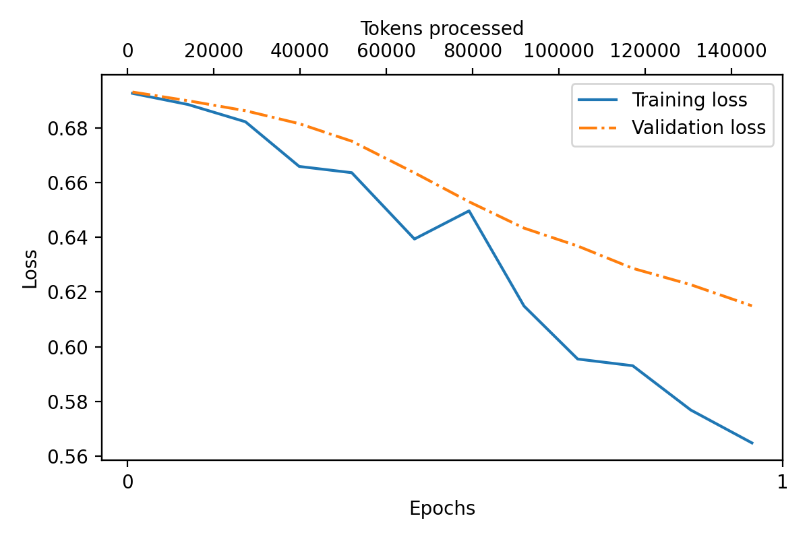
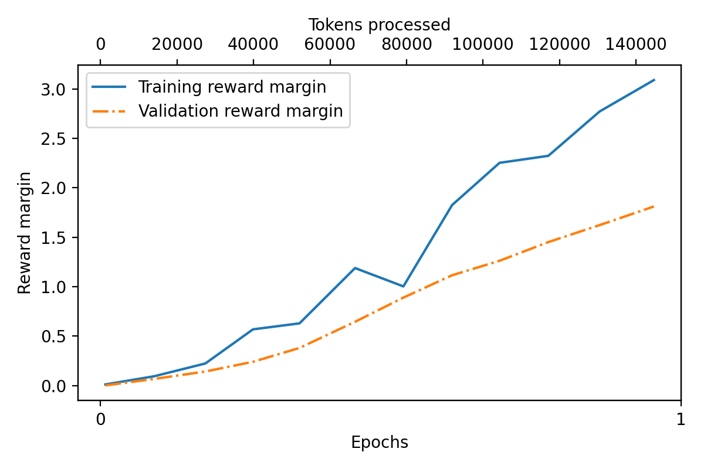
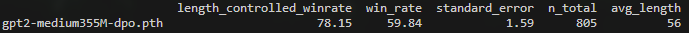

## Assignment 5: DPO for LLM Human Alignment

**学生姓名：** 莫丰源
**日期：** 2026年5月19日

---

# 1. 实验目标

本实验的目标是使用 **Direct Preference Optimization（DPO）** 方法，对已完成监督微调（SFT）的 GPT-2 medium（355M）模型进行人类偏好对齐。

实验使用提供的 `instruction-data-with-preference.json` 数据集（约 1000 个样本）进行 1 个 epoch 的训练，并完成以下任务：

* 跟踪训练过程中的损失（Loss）与奖励边际（Reward Margin）；
* 保存完成对齐后的模型；
* 在 AlpacaEval 基准上进行评估；
* 与未进行 DPO 对齐的 SFT 参考模型进行效果对比。

---

# 2. 代码实现

本实验完整实现了 `run_dpo.py`，并在实验提供代码的基础上进行了必要扩展。

## 2.1 数据处理

实现了以下模块：

* `PreferenceDataset` 类；
* `custom_collate_fn` 函数；
* Prompt Masking 机制。

## 2.2 DPO 核心函数

实现了以下关键函数：

* `compute_dpo_loss`
* `compute_logprobs`
* `compute_dpo_loss_batch`

## 2.3 训练流程

实现了 `train_model_dpo_simple` 作为主要训练循环。

训练过程中：

* `policy_model` 处于 `.train()` 模式，并使用 AdamW 优化器进行参数更新；
* `reference_model` 处于 `.eval()` 模式，并冻结参数；
* 同时跟踪训练集与验证集的：

  * Loss
  * Reward Margin（`chosen_reward - rejected_reward`）

## 2.4 主要超参数

| 超参数                 | 数值     |
| ------------------- | ------ |
| β                   | 0.1    |
| Learning Rate       | 5e-6   |
| Batch Size          | 8      |
| Evaluation Interval | 每 10 步 |

脚本已在可用硬件环境中成功运行，并生成所需训练曲线。

---

# 3. 训练结果

模型完成了 **1 个 epoch** 的训练，在 A100 GPU 上训练时间约为 2~3 分钟。

训练结果表明模型具有明显的偏好优化效果。

## 3.1 训练损失曲线



训练损失与验证损失均呈稳定下降趋势，说明模型优化过程有效且收敛正常。

## 3.2 奖励边际曲线



训练集与验证集的奖励边际均持续上升，说明模型逐渐学会为“chosen（偏好）”回答赋予更高概率，而降低“rejected（非偏好）”回答的概率。

## 3.3 训练结束后的关键统计

| 指标     | 数值      |
| ------ | ------- |
| 最终训练损失 | ≈ 0.563 |
| 最终验证损失 | ≈ 0.615 |
| 训练奖励边际 | > 3.0   |
| 验证奖励边际 | ≈ 1.8   |

整体训练曲线符合实验预期。

---

# 4. 模型生成与 AlpacaEval 评估

使用提供的 `generate_dpo_response.py` 脚本，在 AlpacaEval 测试集上生成模型回答，并成功得到格式正确的 `model_outputs.json` 文件。

随后使用 Qwen Judge 进行评估：

```bash
OPENAI_CLIENT_CONFIG_PATH='/path/to/your/openai_configs.yaml'
alpaca_eval evaluate \
  --model_outputs 'model_outputs.json' \
  --reference_outputs 'reference_outputs.json' \
  --annotators_config '/full/path/to/qwen_judge'
```

## 4.1 评估结果



### 主要指标

| 指标                         | 数值     |
| -------------------------- | ------ |
| Length-controlled Win Rate | 78.15% |
| Raw Win Rate               | 59.84% |
| Standard Error             | 1.59   |
| 样本总数                       | 805    |
| 平均回答长度                     | 56     |

DPO 对齐后的模型显著优于未对齐的 SFT 参考模型。

其中：

* 胜率明显高于 50%；
* Length-controlled Win Rate 达到 78.15%；
* 证明了 DPO 在 GPT-2 medium 模型上的人类偏好对齐效果。

---

# 5. 实验总结

本次实验成功完成了 DPO 用于 LLM 人类偏好对齐的实现。

从训练过程来看：

* Loss 稳定下降；
* Reward Margin 持续上升；
* 模型优化过程稳定。

最终模型在 AlpacaEval 上取得了 **78.15% 的 Length-controlled Win Rate**，验证了 DPO 方法在语言模型对齐任务中的有效性。

总体而言，本实验加深了对以下内容的理解：

* DPO 的核心思想；
* 偏好学习的训练机制；
* 人类对齐在大语言模型中的实际应用。
